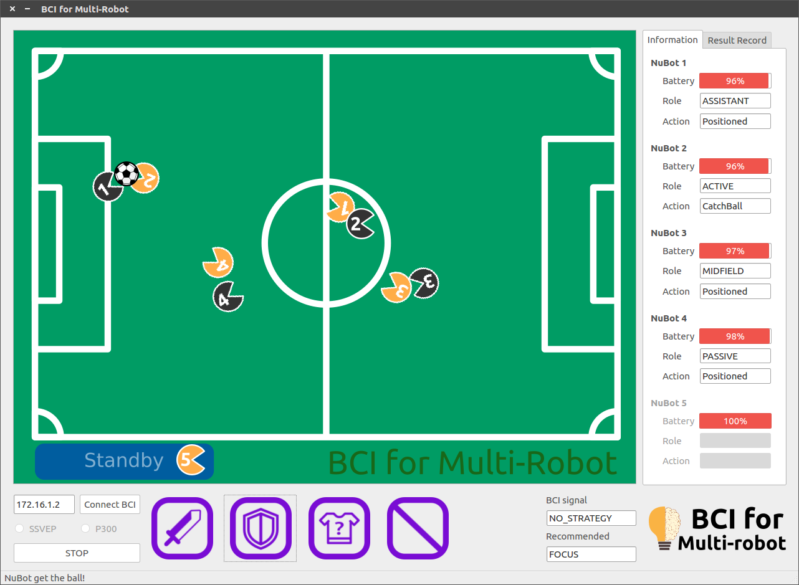
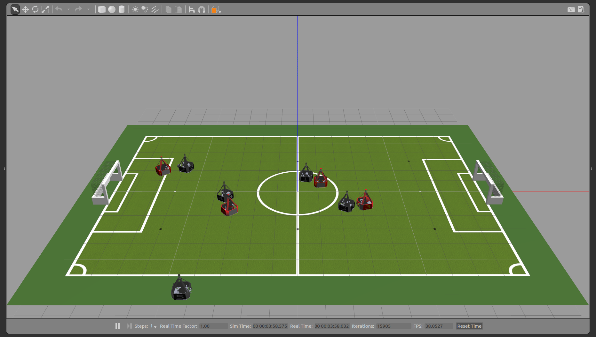
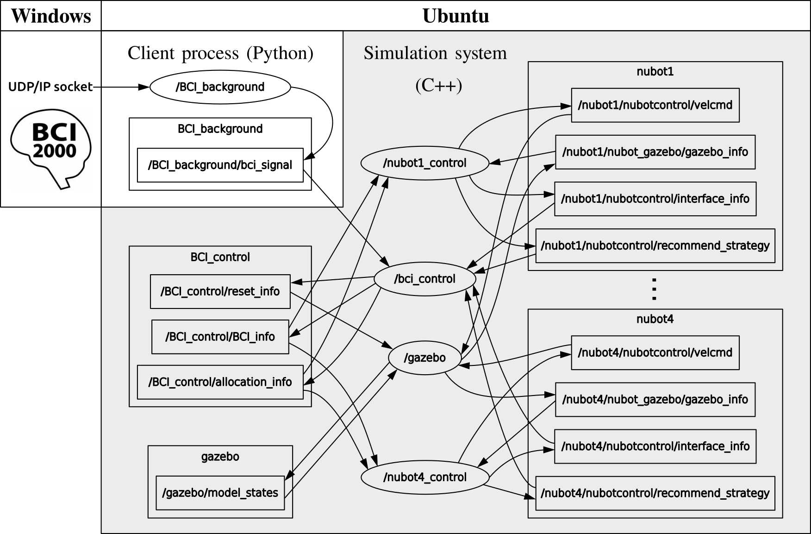

# Human-Multi-Robot Strategic Consensus with Differential World Model and Brain-Computer Interface
Advanced human-multi-robot interactions are being developed for human participation in multi-robot strategy selection. In distributed multi-robot system, the world model maintained by each robot is **inconsistent** due to the measurement errors from onboard sensors so that the differential world model will produce different even incorrect strategy selection. In these project, the human will use Brain-Computer Interface **(BCI)** to participate in the **multi-robot strategy selection** and **control a single-robot at any time**. To the purpose, a specific simulation system has been developed, which composed of: 

1. a non-invasive BCI Emotiv Epoc; 
2. a Graphical User Interface (GUI) based on QT;
3. a multi-robot simulation environment based on Gazebo (open-source 3D robotics simulator)

The different components are integrated through the **Robot Operating System** (ROS) framework. Since the BCI2000 can only run in the Windows system. In our experiments, the BCI2000 opens a **UDP/IP** socket to send messages to a client process running on a Ubuntu machine. The client process encodes the received message according to a pre-established convention and sends the commands to each robot’s control node through ROS topic. Because this is a distributed MRS, each robot in the environment is a separate node, and these nodes also communication through ROS topic.

## Runtime environment

1. Ubuntu 16.04
2. ROS Kinetic
3. Python 3.5
4. Gazebo version 7.0 (the full ROS Kinetic includes the Gazebo 7.0)
**Tips:** If you use the Ubuntu 18.04 and ROS Melodic (includes the Gazebo 9.0), you need to switch the branch to **18.04_melodic**.

## Build

Place the package in your workspace content, and then:

`$ cd BCI_Multi_Robot`

`$ catkin_make --pkg nubot_common`

`$ catkin_make`

## Run

We can launch the simulation system by using a single launch file:

`$ source devel/setup.sh`

`$ roslaunch bci_multi_robot.launch `

Now, you can see a QT Gui for control terminal and the simulation environment in Gazebo:

 

## Framework of simulation system

There are six components included in the simulation system:

1. **nubot_common:**  including the core definitions, ROS messages and ROS services that the simulation system used;
2. **nubot_gazebo:** including the model plug-ins and world plug-in which implement the model control and state feedback in Gazebo;
3. **bci_control:** the QT GUI with interaction interface and information browsers, it is convenient for user operation and state visualization;
4. **bci_background**: receiving and processing EEG signals, then sending the result to bci_control;
5. **nubot_description:** describing the robot model, task model and world with sdf;
6. **nubot_control:** the core program which control the robots, including the strategy generation and motion control.

The rosgraph of the simulation system with four robots: (for simplicity, only two robot nodes are listed, and the remaining robot nodes are similar)

## Video example

